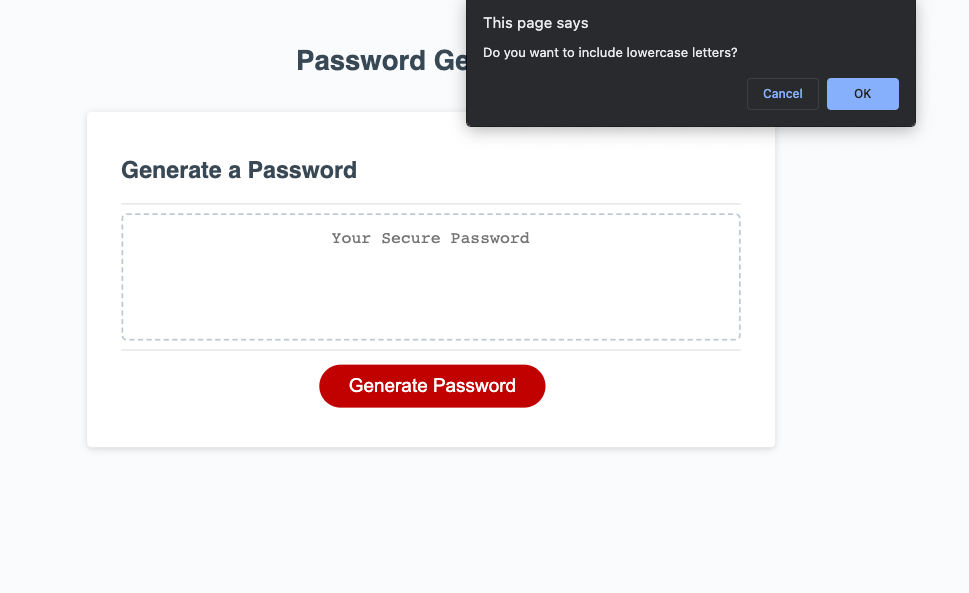
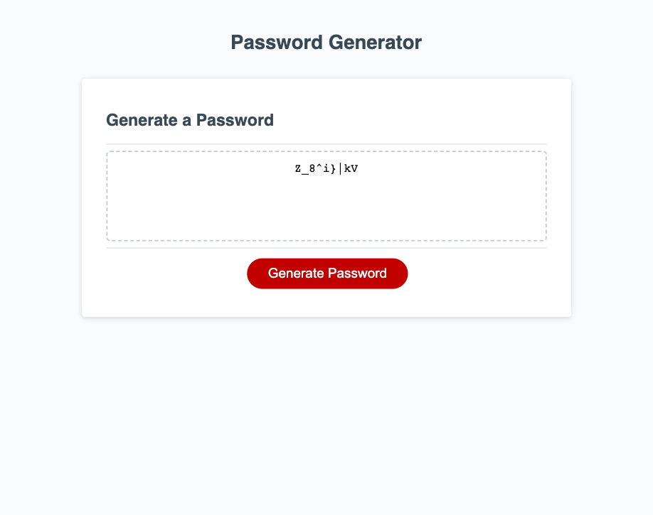

# Password Generator

## Description

This is a JavaScript-based password generator that allows users to create random passwords based on selected criteria for greater security.

## Features

Generates passwords of desired length (between 8 and 128 characters).
Choose from a combination of lowercase letters, uppercase letters, numbers, and/or special characters.
Randomly generates strong passwords based on user's choice.

## Installation

Clone this repository or download all the source code files.

## Usage

Open the index.html file in a web browser to use the password generator.
Click the "Generate Password" button to start the process.
Follow the on-screen prompts to customize your password.
The generated password will be displayed in the "Your Secure Password" input field.

## Screenshots and links

The webpage can be accessed [here] (https://alexandrazykova.github.io/password-generator/)

